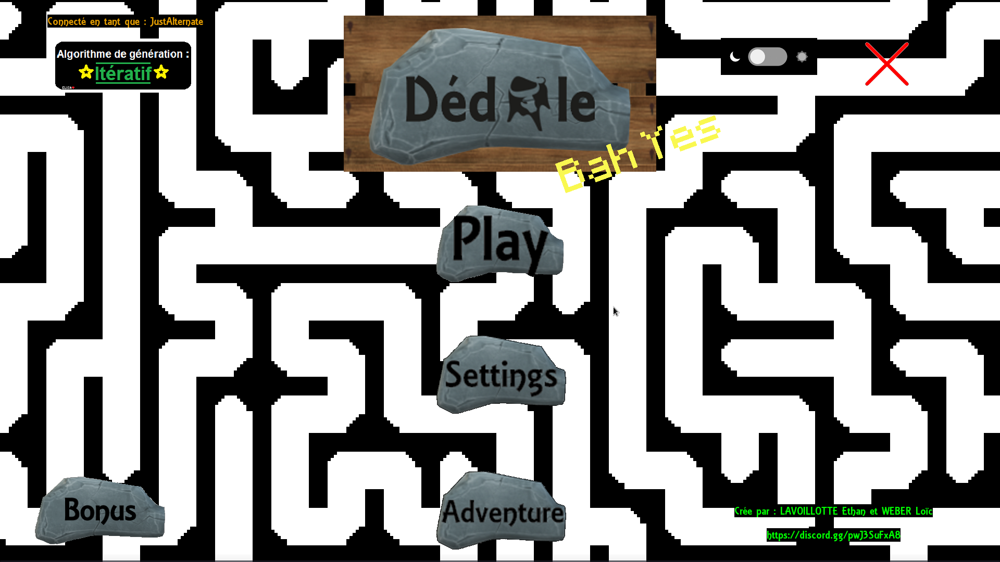
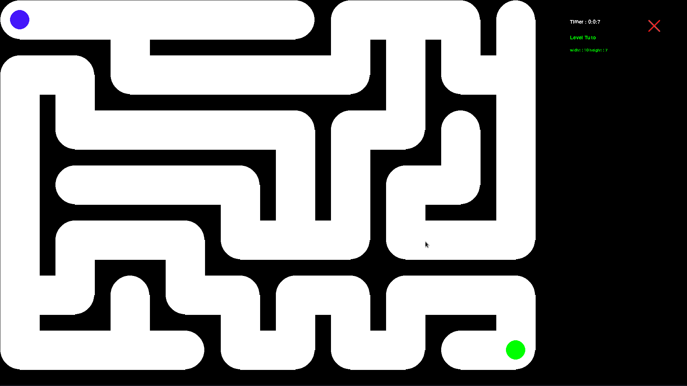
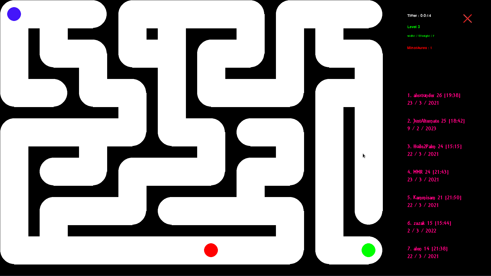
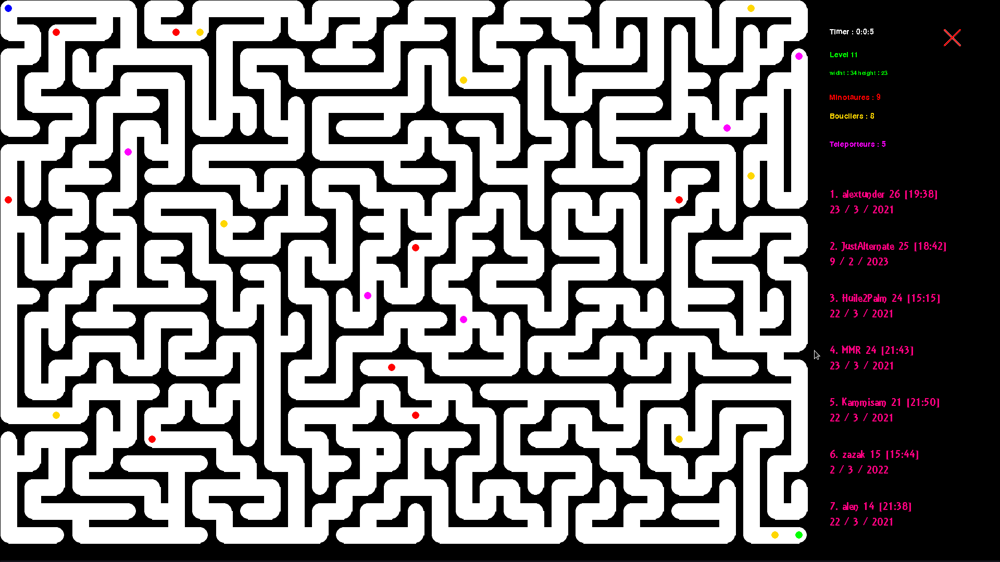
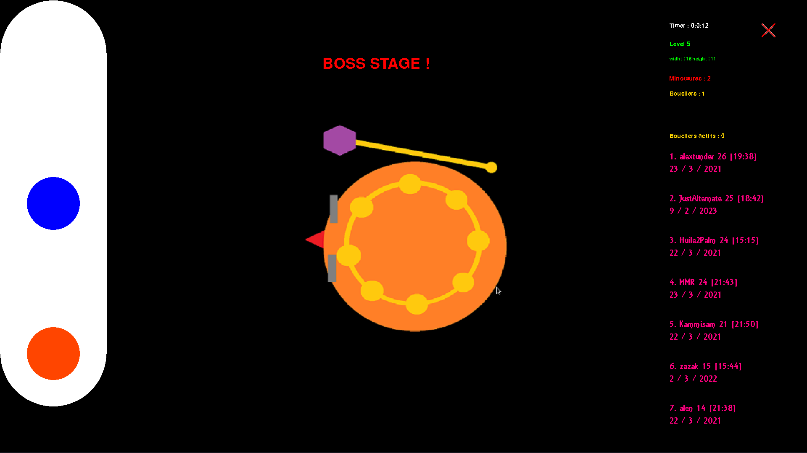
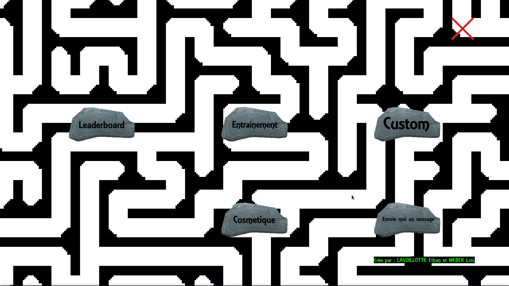
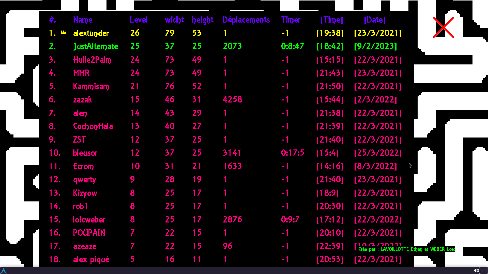
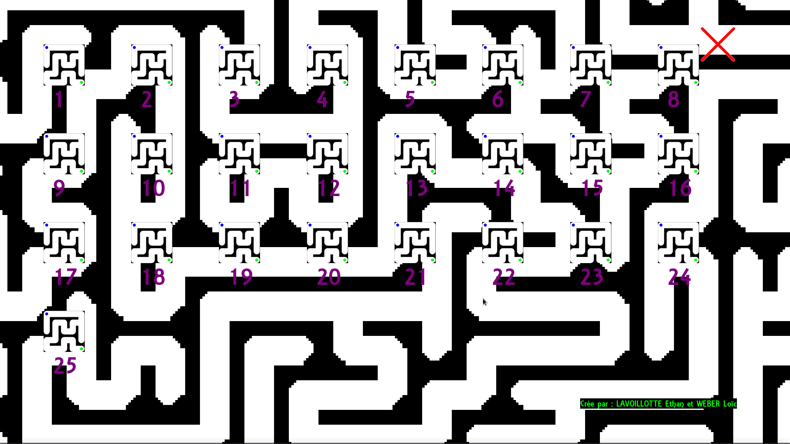
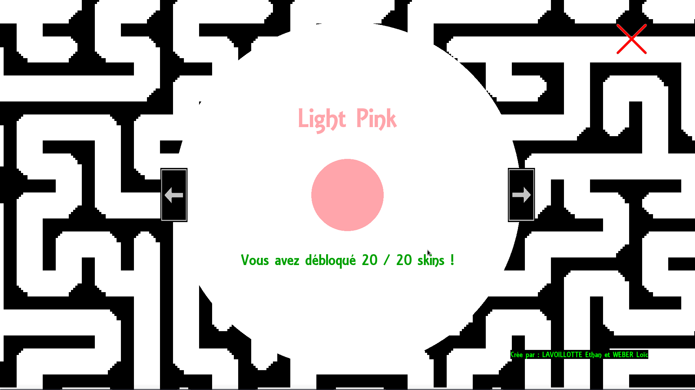
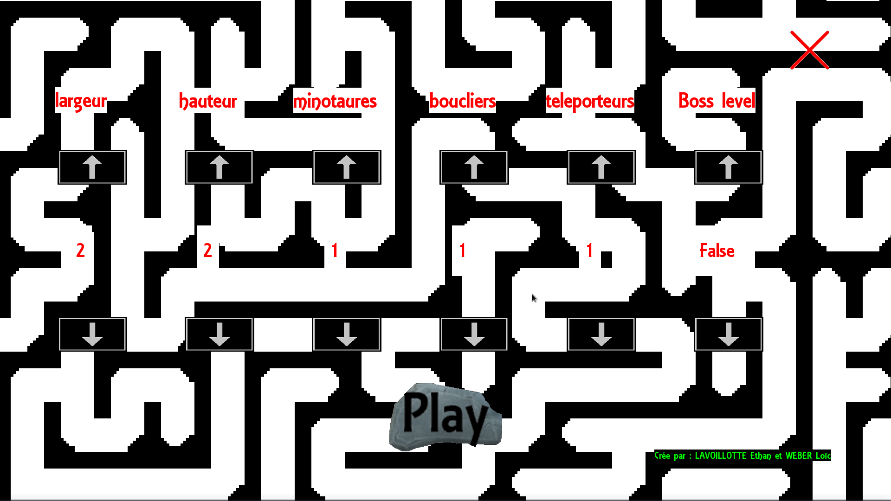

# Dedale
## Python Labyrinthe avec pygame

Dedale est un jeu créé par Lavoilotte Ethan & Weber Loïc pour leur projet en Informatique de terminale.

Dedale est un jeu de labyrinthe écrit en python avec la librarie pygame.

## Mode Normal

Dans Dedale vous pouvez choisir de jouer normalement dans un labyrinthe simple de 15x10.  
(Dans lequel si vous appuyer sur 'p' l'ordinateur vous affichera un chemin vers la sortie.  

## Mode Aventure

Ou bien vous pouvez décider de partir pour le mode Aventure dans lequelle a chaque fois que vous finissez un niveau, le labyrinthe augmente en taille !

Attention car au fur et a mesure que vous avancer dans le mode Aventure, de nouvelle entités font leur apparition rendant votre voyage toujours plus dur et sadique mouahhahahahahaha.  

Dans ce mode, vous pourrez aussi vous mesurer au autre joueurs grace a la présence d'un tableau de score !

---
**ATTENTION SPOIL**
---

## Boss tout les 5 niveaux

A chaque palier de 5 niveau, un boss apparaitra.    
Attention dans ce niveau le but est d'esquiver les missiles rouge que 
le boss envoie sur les cases du labyrinthe !  

## Bonus (SPOIL)

Une fois que vous avez atteint le niveau 5 pour la premiere fois, vous gagnez la possibilité d'accéder a des options "bonus".  

- Le tableau des scores detailés.
- La possibilité de s'entrainer sur des niveaux que vous avez déjà réussi.
- Changer de skin.
- Pouvoir envoyer un message au développeurs.
- Pouvoir personnaliser votre propre niveau.

